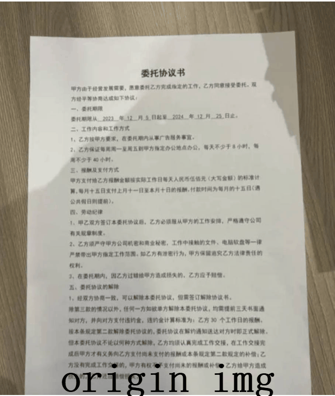
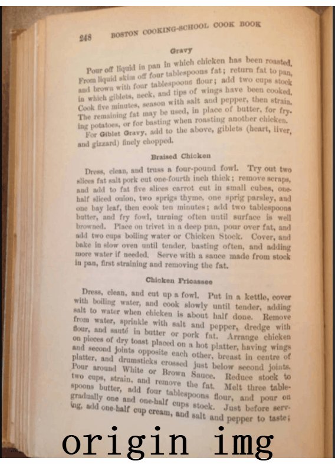

<div align="center">
  <div align="center">
    <h1><b>📊RapidUnWrap</b></h1>
  </div>
  <a href="">=3.8,<3.13-aff.svg"></a>
  <a href=""></a>
<a href="https://semver.org/"></a>
  <a href="https://github.com/psf/black"></a>
  <a href="https://github.com/RapidAI/TableStructureRec/blob/c41bbd23898cb27a957ed962b0ffee3c74dfeff1/LICENSE"></a>

[English](README_en.md) | 简体中文 
</div>

### 最近更新

- **2024.11.15**
    - 完成初版代码，转换 [UVDoc](https://github.com/tanguymagne/UVDoc) 模型为onnx,完善前后处理
- **2024.12.15**
  - 补充去模糊/去阴影/二值化的功能和模型，重新升级为 RapidUndistort


### 简介

本仓库用于进行文档扭曲的修正/文档去模糊/文档去阴影/文档二值化等问题 \ 
提供多种模型和自由组合选择task，支持模型自动下载 \
原始pytorch模型来源参考 [致谢](#致谢) \
[快速使用](#快速使用) [使用建议](#使用建议) [参数说明](#参数说明) [模型地址](https://www.modelscope.cn/studios/jockerK/DocUnwrap/files)

### 在线体验
[modelscope](https://www.modelscope.cn/studios/jockerK/DocUnwrap) [huggingface](https://huggingface.co/spaces/Joker1212/RapidUnwrap)
### 效果展示



### 安装
``` python {linenos=table}
# 建议使用清华源安装 https://pypi.tuna.tsinghua.edu.cn/simple
pip install rapid-undistorted
```

### 快速使用

``` python {linenos=table}
import cv2

from rapid_undistorted.inference import InferenceEngine
img_path = "img/demo.jpg"
engine = InferenceEngine()
# 扭曲修正->去阴影->去模糊 (指定去模糊模型)
output_img, elapse = engine(img_path, ["unwrap", "unshadow", ("unblur", "OpenCvBilateral")])
# 去阴影->去模糊 (指定去模糊模型)
#output_img, elapse = engine(img_path, ["unshadow", ("unblur", "OpenCvBilateral")])
# 默认选择yaml配置文件中第一个unblur模型
#output_img, elapse = engine(img_path, ["unshadow", "unblur"])
# 二值化替代去阴影方法
#output_img, elapse = engine(img_path, ["unwrap", "binarize", "unblur"])
print(f"doc unwrap elapse:{elapse}")
cv2.imwrite("result.png", output_img)

```

### 使用建议
- 去模糊 NAFDPM 模型和直接使用opencv方法都有适用的情况,最好还是在线实际测试为准
- 去阴影模型相对于二值化功能更丰富，效果更好，不建议直接使用二值化方法


### 参数说明
#### 初始化参数
支持传入一个config配置文件，声明需要的task类型和对应的模型，以及path
config_path = "configs/config.yaml"
engine = InferenceEngine(config_path)
```yaml
tasks:
  unwrap:
    models:
      - type: "UVDoc"
        path:
        use_cuda: false
        
  unshadow:
    models:
      - type: "GCDnet"
        sub_models:
          - type: "GCDnet"
            path:
            use_cuda: false
            use_dml: false
          - type: "DRnet"
            path:
            use_cuda: false

  binarize:
    models:
      - type: "UnetCnn"
        path:
        use_cuda: false

  unblur:
    models:
      - type: "OpenCvBilateral"
        path:
      - type: "NAFDPM"
        path:
        use_cuda: false

```
#### 执行参数
```python
engine(img_path, task_list)
engine(img_path, ["unwrap", "unshadow", ("unblur", "OpenCvBilateral")])
```

### 致谢

unwrap: [UVDoc](https://github.com/tanguymagne/UVDoc)
unshadow: [GCDnet](https://github.com/ZZZHANG-jx/GCDRNet)
unblur: [NAFDPM](https://github.com/ispamm/NAF-DPM)
binarize: [UnetCnn](https://github.com/sajjanvsl/U-Net-CNN-for-binarization-of-Historical-Kannada-Handwritten-Palm-Leaf-Manuscripts)

### 贡献指南

欢迎提交请求。对于重大更改，请先打开issue讨论您想要改变的内容。

有其他的好建议和集成场景，作者也会积极响应支持

### 开源许可证

该项目采用[Apache 2.0](https://github.com/RapidAI/TableStructureRec/blob/c41bbd23898cb27a957ed962b0ffee3c74dfeff1/LICENSE)
开源许可证。

