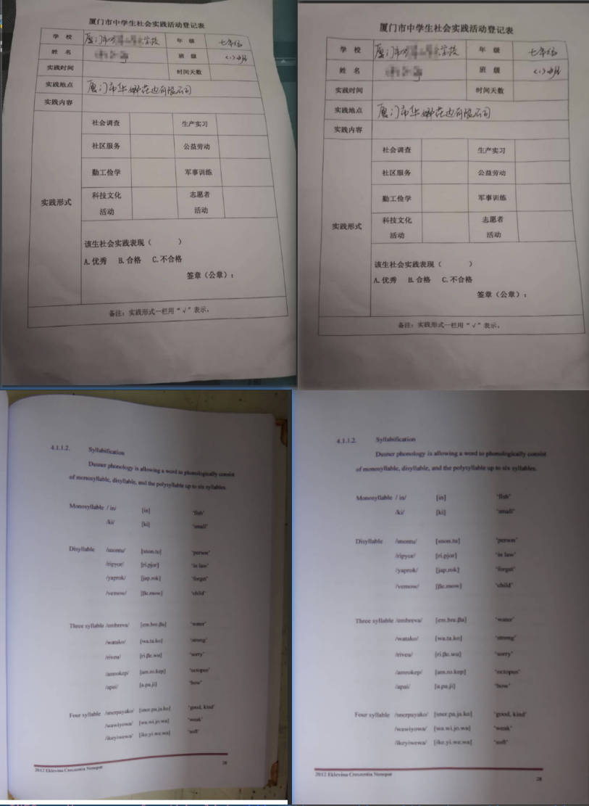

<div align="center">
  <div align="center">
    <h1><b>📊RapidUnWrap</b></h1>
  </div>
  <a href="">=3.8,<3.13-aff.svg"></a>
  <a href=""></a>
<a href="https://semver.org/"></a>
  <a href="https://github.com/psf/black"></a>
  <a href="https://github.com/RapidAI/TableStructureRec/blob/c41bbd23898cb27a957ed962b0ffee3c74dfeff1/LICENSE"></a>
</div>

### Recent Updates

- **2024.11.15**
  - Completed the initial version of the code, converted the [UVDoc](https://github.com/tanguymagne/UVDoc) model to onnx, and improved pre- and post-processing.

### Introduction

This repository is used for correcting document distortions and can also alleviate perspective and rotation issues to some extent.

### Online Experience
[modelscope](https://www.modelscope.cn/studios/jockerK/DocUnwrap) [huggingface](https://huggingface.co/spaces/Joker1212/RapidUnwrap)

### Effect Demonstration


### Installation
``` python {linenos=table}
pip install rapid-unwrap
```

### Quick Start

``` python {linenos=table}
import cv2

from rapid_unwrap.inference import DocUnwrapper
img_path = "img/demo4.jpg"
doc_unwrapper = DocUnwrapper(img_path)
unwrapped_img, elapse = doc_unwrapper(img_path)
print(f"doc unwrap elapse:{elapse}")
cv2.imwrite("unwarped.png", unwrapped_img)

```


### Acknowledgments

[UVDoc](https://github.com/tanguymagne/UVDoc)


### Contribution Guidelines

Pull requests are welcome. For major changes, please open an issue first to discuss what you would like to change.

If you have other good suggestions or integration scenarios, the author will actively respond and support them.


### Open Source License

This project is licensed under the [Apache 2.0](https://github.com/RapidAI/TableStructureRec/blob/c41bbd23898cb27a957ed962b0ffee3c74dfeff1/LICENSE) license.
